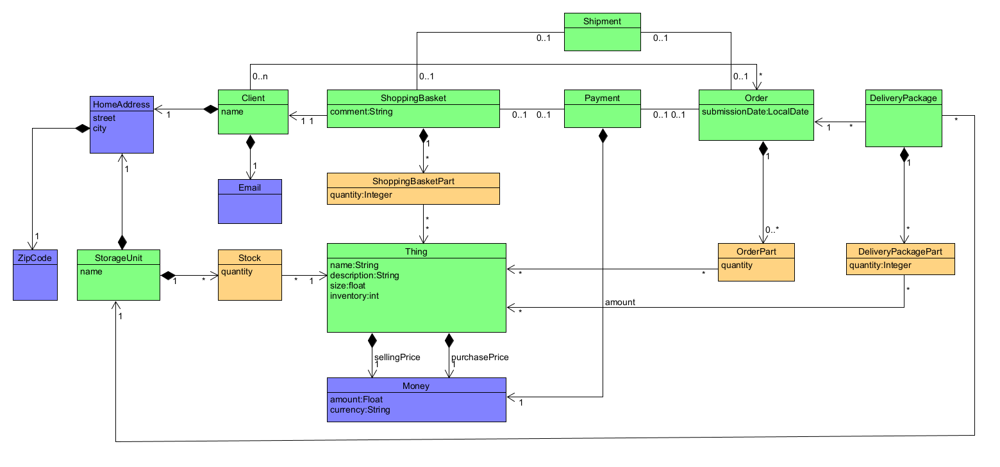

# Simple Online Shop

Backend service for a modular online shop. The application exposes a REST API for product catalog management, client registration, shopping baskets, orders, stock, storage units, and delivery packages.

The codebase is organized around Domain-Driven Design (DDD) concepts. Domain rules live inside the relevant bounded context, while application services coordinate use cases and REST controllers provide the HTTP interface.

## Features

- Product catalog management with sales-price and stock updates
- Client registration and lookup by email or ID
- Shopping baskets with stock reservation and checkout
- Order lifecycle management: submit, cancel, and deliver
- Multiple storage units with per-location stock levels
- Delivery-package allocation across storage units
- Delivery-package status tracking
- PostgreSQL persistence through Spring Data JPA
- OpenAPI/Swagger documentation
- Unit, integration, architecture, and Testcontainers-based tests

## Architecture

The application is split into bounded contexts under `src/main/java/com/neotee/ecommercesystem/shopsystem`:

| Context | Responsibility |
| --- | --- |
| `client` | Client registration and client data |
| `product` | Product catalog and sales prices |
| `shoppingbasket` | Basket contents, reservations, and checkout |
| `order` | Order creation and lifecycle |
| `storageunit` | Warehouses and inventory |
| `deliverypackage` | Allocation of order items into packages |
| `delivery` | Delivery lookup and package status |
| `payment` | Payment records and payment totals |

Shared domain primitives such as IDs, money, email addresses, and postal codes are located in `domainprimitives`.



### Typical checkout flow

1. Register a client.
2. Create or retrieve the client's shopping basket.
3. Add products to the basket. Available stock is reserved.
4. Check out the basket to create an order.
5. Allocate order items to one or more storage units.
6. Track delivery packages and update their status.

## Technology Stack

- Java 26
- Spring Boot 4.1.1
- Spring Web MVC
- Spring Data JPA and Hibernate
- PostgreSQL 16
- Gradle 9.4.1
- JUnit 5, Mockito, ArchUnit, and Testcontainers
- Springdoc OpenAPI
- Lombok

## Prerequisites

- JDK 26
- Docker and Docker Compose
- Git

The Gradle wrapper is included, so a system-wide Gradle installation is not required.

## Getting Started

### 1. Clone the repository

```bash
git clone https://github.com/neotee314/Simple-Online-Shop.git
cd Simple-Online-Shop
```

### 2. Start PostgreSQL

The included Compose file starts the database expected by the application:

```bash
docker compose up -d postgres
```

The default development database configuration is:

| Setting | Value |
| --- | --- |
| Host | `localhost` |
| Port | `5432` |
| Database | `ecommerce` |
| Username | `postgres` |
| Password | `postgres` |

### 3. Run the application

On Windows:

```powershell
.\gradlew.bat bootRun
```

On Linux or macOS:

```bash
./gradlew bootRun
```

The API is available at `http://localhost:8080`.

Spring JPA is configured with `ddl-auto: update` for local development. Use an explicit migration strategy before deploying to a production environment.

## Docker

The repository contains a multi-stage `Dockerfile` for packaging the application:

```bash
docker build -t simple-online-shop .
docker run --rm -p 8080:8080 simple-online-shop
```

The container expects PostgreSQL to be reachable using the datasource settings in `src/main/resources/application.yml`. When running both services in Compose, configure the application datasource to use the database service name (`postgres`) instead of `localhost`.

## REST API

All endpoints use the `/api/v1` prefix and exchange JSON unless stated otherwise. IDs are UUIDs.

### Clients

| Method | Endpoint | Description |
| --- | --- | --- |
| `GET` | `/api/v1/clients/all` | List all clients |
| `GET` | `/api/v1/clients?email={email}` | Find a client by email |
| `GET` | `/api/v1/clients/{id}` | Find a client by ID |
| `POST` | `/api/v1/clients` | Register a client |
| `PUT` | `/api/v1/clients/{id}` | Update a client |
| `DELETE` | `/api/v1/clients/{id}` | Delete a client |

Example request:

```bash
curl -X POST http://localhost:8080/api/v1/clients \
  -H "Content-Type: application/json" \
  -d '{
    "name": "Ada Lovelace",
    "email": "ada@example.com",
    "street": "1 Analytical Engine Way",
    "city": "London",
    "zipCode": "NW1 6XE"
  }'
```

### Products

| Method | Endpoint | Description |
| --- | --- | --- |
| `GET` | `/api/v1/products` | List all products |
| `GET` | `/api/v1/products/search?name={name}` | Search products by name |
| `GET` | `/api/v1/products/{id}` | Get a product |
| `POST` | `/api/v1/products` | Add a product |
| `PATCH` | `/api/v1/products/{id}/price` | Change the sales price |
| `PATCH` | `/api/v1/products/{id}/stock?quantity={quantity}` | Update product stock |
| `GET` | `/api/v1/products/{id}/salesPrice` | Get the current sales price |
| `DELETE` | `/api/v1/products/{id}` | Remove a product |
| `DELETE` | `/api/v1/products/all` | Delete the entire catalog |

### Shopping baskets and orders

| Method | Endpoint | Description |
| --- | --- | --- |
| `GET` | `/api/v1/shoppingBaskets?clientId={clientId}` | Get a client's basket |
| `GET` | `/api/v1/shoppingBaskets/{basketId}` | Get a basket by ID |
| `POST` | `/api/v1/shoppingBaskets/{basketId}/parts` | Add a product and quantity |
| `DELETE` | `/api/v1/shoppingBaskets/{basketId}/parts/{productId}` | Remove a product |
| `DELETE` | `/api/v1/shoppingBaskets/{basketId}/parts/{productId}/quantity/{quantity}` | Remove a quantity |
| `DELETE` | `/api/v1/shoppingBaskets/{basketId}/clear` | Clear a basket |
| `POST` | `/api/v1/shoppingBaskets/{basketId}/checkout` | Convert a basket into an order |
| `GET` | `/api/v1/orders/{id}` | Get an order |
| `GET` | `/api/v1/orders/history?email={email}` | Get a client's order history |
| `PATCH` | `/api/v1/orders/{id}/submit` | Submit an order |
| `PATCH` | `/api/v1/orders/{id}/cancel` | Cancel an order |
| `PATCH` | `/api/v1/orders/{id}/deliver` | Mark an order as delivered |

Add-to-basket request body:

```json
{
  "productId": "00000000-0000-0000-0000-000000000000",
  "quantity": 2
}
```

### Storage and stock

| Method | Endpoint | Description |
| --- | --- | --- |
| `GET` | `/api/v1/storageUnits` | List storage units |
| `GET` | `/api/v1/storageUnits/{id}` | Get a storage unit |
| `POST` | `/api/v1/storageUnits` | Create a storage unit |
| `POST` | `/api/v1/storageUnits/{storageUnitId}/stocks/{productId}/add?quantity={quantity}` | Add stock |
| `POST` | `/api/v1/storageUnits/{storageUnitId}/stocks/{productId}/remove?quantity={quantity}` | Remove stock |
| `PUT` | `/api/v1/storageUnits/{storageUnitId}/stocks/{productId}?newQuantity={quantity}` | Set stock |
| `GET` | `/api/v1/storageUnits/{storageUnitId}/stocks/{productId}` | Get stock at one location |
| `GET` | `/api/v1/storageUnits/stocks/total/{productId}` | Get total available stock |

### Delivery and delivery packages

| Method | Endpoint | Description |
| --- | --- | --- |
| `GET` | `/api/v1/deliveries/{deliveryId}` | Get a delivery |
| `GET` | `/api/v1/deliveries/{deliveryId}/packages` | List packages for a delivery |
| `GET` | `/api/v1/deliveries/packages/{packageId}/status` | Get package status |
| `PATCH` | `/api/v1/deliveries/packages/{packageId}/status` | Update package status |
| `GET` | `/api/v1/deliveries/history?email={email}` | Get delivery history |
| `GET` | `/api/v1/deliveryPackages?orderId={orderId}` | List packages for an order |
| `GET` | `/api/v1/deliveryPackages/order/{orderId}` | List packages for an order |
| `GET` | `/api/v1/deliveryPackages/order/{orderId}/storageUnit/{storageUnitId}` | Get a package by order and storage unit |

Valid delivery-package statuses are `NOT_SHIPPED`, `IN_TRANSIT`, and `DELIVERED`.

## API Documentation

When the application is running, OpenAPI documentation is available at:

- Swagger UI: `http://localhost:8080/swagger-ui/index.html`
- OpenAPI JSON: `http://localhost:8080/v3/api-docs`

## Configuration

Application defaults are defined in `src/main/resources/application.yml`. Override database settings with Spring environment variables or command-line properties when running outside the default local setup:

```bash
./gradlew bootRun --args="--spring.datasource.url=jdbc:postgresql://localhost:5432/ecommerce"
```

Do not commit production credentials. Use environment-specific configuration or a secrets manager for deployed environments.

## Testing

Run the full test suite with the Gradle wrapper:

```powershell
.\gradlew.bat test
```

```bash
./gradlew test
```

Integration tests use Testcontainers and therefore require a working Docker installation.

## Project Layout

```text
src/
  main/
    java/com/neotee/ecommercesystem/
      domainprimitives/     Shared value objects and identifiers
      events/                Domain events
      exceptions/            API and domain exception handling
      shopsystem/            Bounded contexts
      usecases/              Application use-case contracts
    resources/
      application.yml        Runtime configuration
  test/                      Unit, integration, architecture, and REST tests
images/                      Architecture diagrams
docker-compose.yml           Local PostgreSQL service
Dockerfile                   Container build definition
build.gradle                 Gradle build and dependency configuration
```

## Development Guidelines

- Keep business invariants inside domain objects and domain services.
- Keep controllers focused on HTTP translation and validation.
- Use application services to coordinate use cases across aggregates.
- Prefer domain primitives over raw strings and numbers for business concepts.
- Add or update tests when changing business behavior.
- Keep API changes backward-compatible unless a versioned endpoint is introduced.

## License and Contact

This project is maintained by Abolfazl Heidari. For questions about the project, contact `abheidari99@gmail.com`.
